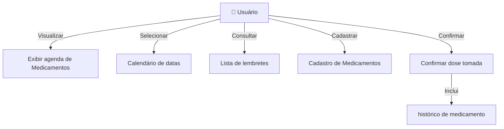

```mermaid
---
config:
  layout: fixed
---
flowchart TD
    U["👤 Usuário"] -- "Visualizar" --> UC1["Exibir agenda de Medicamentos"]
    U -- "Selecionar" --> UC2["Calendário de datas"]
    U -- "Consultar" --> UC3["Lista de lembretes"]
    U -- "Cadastrar" --> UC4["Cadastro de Medicamentos"]
    U -- "Confirmar" --> UC5["Confirmar dose tomada"]
    UC5 -- "Inclui" --> UC8[" histórico de medicamento" ]
```
